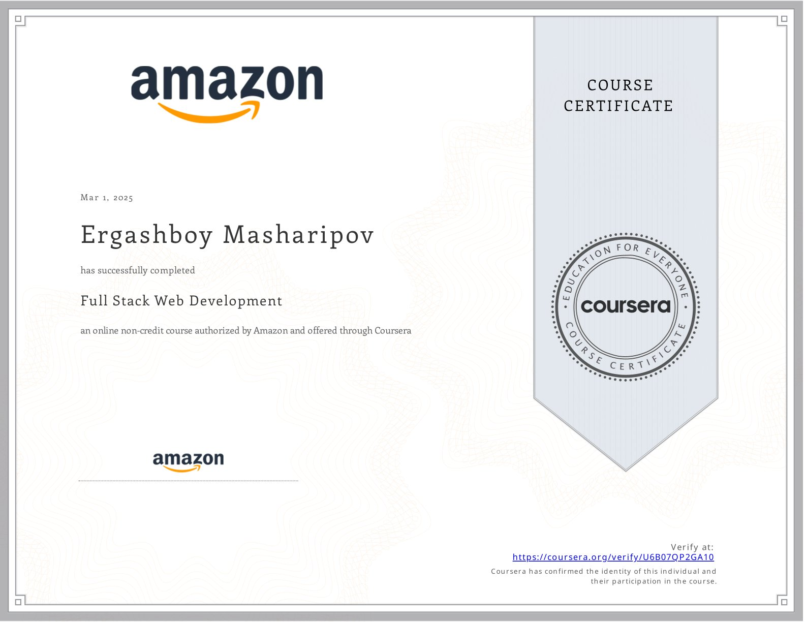

<h1 align="center">

</h1>

  <strong>Building Scalable, Efficient, and User-Centric Applications</strong> 
  Specializing in Web Development, Backend Systems, and AI Solutions

---

## 👨‍💻 About Me

👋 Hi, I'm **Masharipov Ergashboy**, a **Full-Stack Developer** with experience in **HTML, CSS, JavaScript, PHP, Java, and MySQL**. Currently, I'm **studying IT at Japan Digital University**.  

I specialize in:  
✔️ **Developing interactive and dynamic web applications using modern technologies**.  
✔️ **Designing and optimizing high-performance and scalable backend systems**.  
✔️ **Leveraging AI technologies to enhance learning experiences**.  
✔️ **Creating and managing databases for data-driven applications**.  

🚀 Currently working on:  
- 📚 **An education management system for JDU**.  
- 📖 **An online learning platform for my book "Bir Kunda Bir Suhbat"**.  
- 🛍️ **A mobile app for my e-commerce shop "Qulay_Shop_Uz"**.  

> **My goal is to build innovative and user-friendly applications that make a real impact.**  

---

## 🛠️ Technologies & Tools

---

## 📜 My Certifications  

### 🏆 Full Stack Web Development - Amazon (via Coursera)  

✅ **Verify Here**: [Coursera Link](https://coursera.org/verify/U6B07QP2GA10)  

---

## 📄 My CV

📌 **[Download My CV](cv.pdf)**

---

## 📬 Contact & Connect  

   &nbsp;   &nbsp; <a href="mailto:ergashmasharipov88@gmail.com">   
